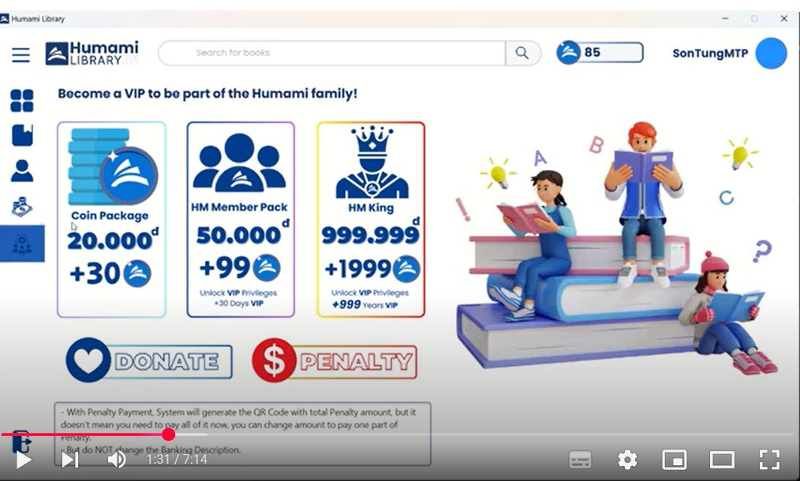

# Library Management System Desktop Application #

REVIEW: https://youtu.be/9lCxDek1jgs

_User Home Page_

_User Payment_

This project is a Desktop Library Management Application, developed as a part of the Object-Oriented Programming (OOP) course during Year 2, Semester 1 at UET - VNU.

## 📋 Overview ##

The application serves as a complete library management system, designed to streamline book borrowing, payment processing, and transaction tracking. It leverages several modern APIs for enhanced functionality and real-world integration.

## ✨ Key Features ##
1. Search Books with **Google Books API**:
- Users can search for books using the **Google Books API**.
- Users can add books directly to the library system from the search results.
2. Generate Payment QR Codes Automatically with **VietQR API**
3. Transaction History Reading with **Casso API**
## 🛠️ Technologies Used ##
**Programming Language:** Java

**Framework:** JavaFX for desktop UI

**APIs:**
- Google Books API for book searches
- VietQR API for payment QR generation
- Casso API for reading bank transaction history

**Database:** 
- MySQL for local data storage
## 🚀 Setup Instructions ##
- Clone this repo.
- Get your own API Key: Google Books API from Google, VIETQR Prefix Link from VietQR, link Casso account with your Bank account and get API key.
- If you have any difficulty during installation, please contact me.

📞 Contact
Developer: 

**To Quang Huy (_tohuy2710_)**
- Email: tohuy2710@gmail.com
- Social: http://facebook.com/tohuy.2710

**Nguyen Van Manh (_manhnv2110_)**
- Social: https://www.facebook.com/ng.vanmanh21102005

**Nguyen Nhat Minh (_nNm205_)**
- Social: https://www.facebook.com/nnminh2005

**University:** University of Engineering and Technology (UET), Vietnam National University (VNU)
This project demonstrates the practical application of Object-Oriented Programming Courses.